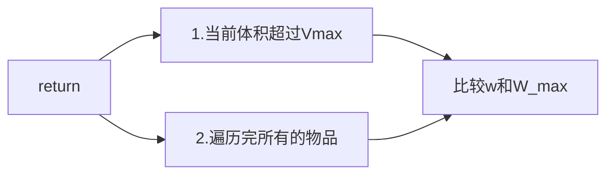
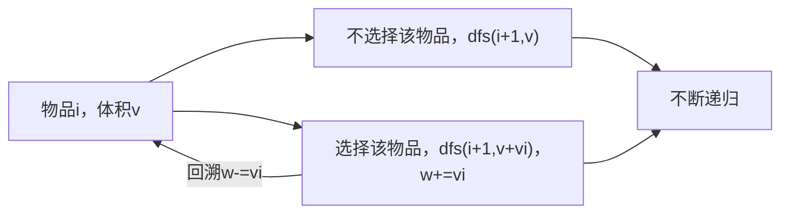
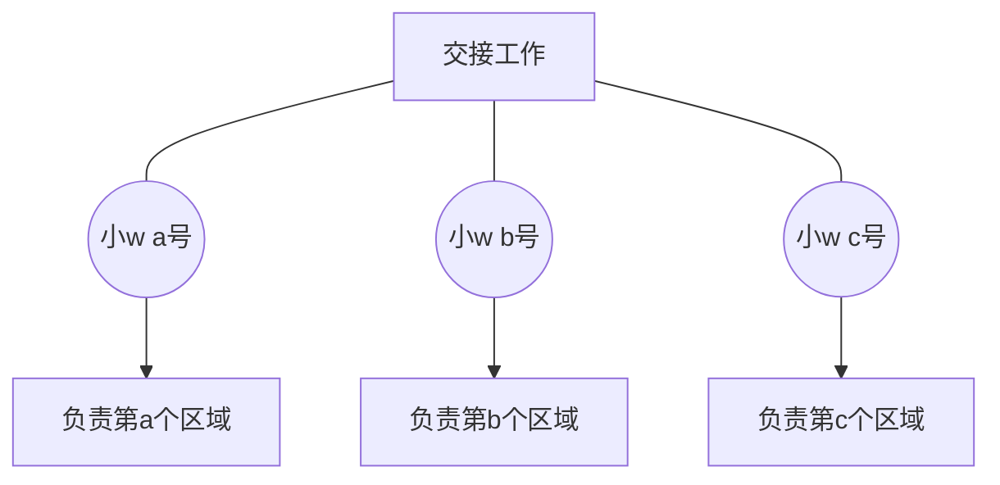

@[NNUer(带专版](https://blog.csdn.net/2301_80200399)

# Dp：dfs的优化版（动态规划本质探讨）

@[Top](%E7%9B%AE%E5%BD%95)

前言：

在还没有接触到算法时，我一直认为，啊，算法是什么，写一个代码模拟一下人解决问题的过程不就行了吗（:stuck_out_tongue_closed_eyes:）。只会模拟和暴力:stuck_out_tongue_closed_eyes:,蚌埠住了。。。直到我遇到了dp.......

啊！我的dfs有什么问题吗？我的dfs怎么了？为什么就会超时呢？哪里多算了。

但凡能用dp解决的问题，用无穷的时间也可以用dfs来解决的！！！！So.....我冥思苦想，彻夜**（脑补一个成语）。终于在那一天夜里，我发现了他们的之间的小秘密:pleading_face:

## 一.DFS的简介：

### 1.dfs的学术解释

深度优先搜索（Depth-First Search，DFS）是一种用于遍历或搜索树形结构或图形数据结构的常用算法。DFS从根节点（或任意起始节点）开始，尽可能深入地探索每个分支，然后回溯。可以使用递归或显式栈数据结构来实现DFS。

以下是DFS的工作原理：

1. 从初始节点开始。
2. 探索其中一个子节点。
3. 如果子节点有未访问的邻居节点，选择一个并重复步骤2。
4. 如果当前分支中的所有邻居节点都被访问或没有更多未访问节点，回溯到上一个节点。
5. 重复步骤2-4，直到所有节点都被访问或找到目标节点。

### 2.dfs的通俗理解

**emmm以上都是学术解释**，接下来由博主结合例题进行通俗易懂为你们讲解一下：

例题：[39. 组合总和 - 力扣（LeetCode）](https://leetcode.cn/problems/combination-sum/)

> 题目：给你一个 **无重复元素** 的整数数组 `candidates` 和一个目标整数 `target` ，找 出`candidates` 中可以使数字和为目标数 `target` 的 所有 **不同组合** ,并以列表形式返回。你可以按**任意顺序** 返回这些组合。`candidates` 中的 **同一个** 数字可以 **无限制重复被选取** 。

> 如果至少一个数字的被选数量不同，则两种组合是不同的。

> 对于给定的输入，保证和为 `target` 的不同组合数少于 `150` 个。

题目简化：从一组数中挑选任意个数（可重复），求这些数的和为给定的值`target`。求有多少种取法。（不简化的话，用vector储存结果就好了）

分析：我们只需要不断地从数组中选取一些数，判断这些数的和是否等于`target`即可。这里我们使用`暴力的搜索`。如何`不重不漏的选取这些数`，涵盖所有的情况呢？这就要用到dfs的思想。算法解释如下：

                从第一个数开始选，不断地选取第一个数，直到所有数之和`sum`超过或等于`target`。此时如果超过，则取法`ans`+1，否则数之和`sum`减去第一个数，然后开始选择数组`candidates`的下面一个数。以此类推，当一开始选第一个数的所有情况被遍历完后，开始从第二个数选。

即：dfs（cur，sum）//从当cur开始选，sum为当前数的总和。

```cpp
//全局变量（最好不要用,意思是这个意思）
vector<int> candidates(N);
int target;
int count=0;
......//这里省略部分代码
void dfs(int cur ,int sum)
{       
        //结果++
        if (sum == target) {
            count++;
            return;
        }
        //已经选完或溢出
        if (sum > target || cur == candidates.size()) {
            return;
        }
        // 选择当前数
        dfs(cur, sum + nums[cur]);
        // 选择下一个数
        dfs(cur + 1, sum);
}
int main()
{
.......
dfs(0,0);
.......
}
```

### 3.dfs的本质

所谓dfs核心思想在于这个s（Search)，搜索算法大致分为两类一个是BFS一个是DFS，DFS的代码最为简单也是比较容易理解的。

其本质就是暴力搜索，只要想到一种不重不漏的搜索方法，且以`深度优先搜索`就可以称得上是dfs了。

```cpp
// 选择当前数
dfs(cur, sum + nums[cur]);
// 选择下一个数
dfs(cur + 1, sum);
```

上面的代码就是dfs搜索的过程

```cpp
//结果++
if (sum == target) {
    count++;
    return;
}
//已经选完或溢出
if (sum > target || cur == candidates.size()) {
     return;
}
```

完善dfs的终止条件

由于本专题主要讲的是dp，dfs这些内容就先回顾到这里了。

dfs和bfs的区别，一张图片即可：

D就是纵向，B就是横向，Deep和Width

## 二.DP

### 1.动态规划（DP）介绍：

动态规划（Dynamic Programming，DP）是一种解决复杂问题的算法设计和优化技术。它主要用于解决最优化问题，其中问题可以分解为重叠子问题，并且具有最优子结构性质。动态规划的目标是通过将问题分解为较小的子问题，避免重复计算，从而找到问题的最优解。以下是动态规划算法的基本原理和步骤：

1. **定义子问题**：将原问题分解为更小的子问题。这是动态规划的核心思想之一。通常，问题的解可以通过较小问题的解构建而成。这一步骤通常需要使用递归或迭代的方式来定义子问题。

2. **状态转移方程**：确定如何从子问题的解构建出原问题的解。状态转移方程描述了子问题与原问题之间的关系。它是一个数学表达式，将当前子问题的解与之前子问题的解联系起来。状态转移方程是动态规划算法中最关键的部分。

3. **解决子问题**：通过递归或迭代的方式，从小到大地解决子问题。通常，可以使用一个数组或表格来保存子问题的解，以避免重复计算。

4. **边界条件**：在递归或迭代过程中，需要明确定义基本的边界条件，以结束递归。边界条件通常是一些基本的情况，例如子问题的最小规模。

5. **构建解**：根据解决子问题的结果，构建出原问题的解。这是通过根据状态转移方程得到的中间结果来完成的。

6. **空间和时间优化**：在实际应用中，需要考虑如何优化算法的时间和空间复杂度。这可以包括使用滚动数组、压缩状态空间或其他方法来降低内存使用和提高运行效率。

动态规划算法通常用于解决各种最优化问题，如寻找最短路径、最大价值、最长公共子序列等。它在计算机科学、人工智能、经济学、运筹学等领域都有广泛的应用。虽然动态规划算法在某些情况下可能需要大量计算，但由于其有效的问题分解和解决方法，它通常能够高效地解决复杂问题。

### 2.《从dfs到动态规划dp》

#### 例题导入：

[背包问题 （点我打开哦）](https://www.acwing.com/problem/content/4/)

> **题目：**
> 
> 有 N 种物品和一个容量是 V 的背包，每种物品都有无限件可用。
> 
> 第 i 种物品的体积是 vi，价值是 wi。
> 
> 求解将哪些物品装入背包，可使这些物品的总体积不超过背包容量，且总价值最大。  
> 输出最大价值。
> 
> **输入格式：**
> 
> 第一行两个整数，N，V，用空格隔开，分别表示物品种数和背包容积。
> 
> 接下来有 N 行，每行两个整数 vi,wi，用空格隔开，分别表示第 i 种物品的体积和价值。
> 
> **输出格式：**
> 
> 输出一个整数，表示最大价值。
> 
> **数据范围：**
> 
> 0<N,V≤1000  
> 0<vi,wi≤1000

#### 从dfs到dp的过渡

##### 暴力的dfs

对于这个问题，作为初学者的我们采用搜索的思想，将所有结果遍历一遍：

> 遍历算法：
> 
> 表示：
> 
>         `dfs（i,v）// i表示遍历到第i个位置，v表示当前所用体积`
> 
> return ：



>   递归与回溯:



##### dfs到dp的思考：

通过之前的代码，我们可以发现代码的时间复杂度为O（2^n） 非常的大，很难不LTM

那么在这种情况下，我们应该如何处理这个问题呢？（接下来是见证dp诞生的时刻:cowboy_hat_face:）

*<u><strong>第一天</strong></u>*，我们从宏观的角度去分析dfs的搜索，我们可以发现在这一题中dfs完美涵盖了所有的结果，是没有办法进行减枝(限制搜索条件，提前return)的。最终得到dfs好完美，根本没有办法动。睡。

***<u>第二天</u>***，我们去从微观的角度，一步一步看这个dfs，看他的每一个操作究竟干了些什么事情，为什么会这么慢。为了更好的观察dfs，我们把全局变量w，也就是不断迭代更新的重量w，作为观察对象。为什么选择这个观察对象？因为每一次迭代都涉及到w的更新`(w=w or w+=v[i]）`。睡。

***<u>第三天</u>***，我们去观看小w的表演。我们可以发现，在整个代码中小w在回溯与递归中跑来跑去，小w表示：我真的是太累了！！！有没有什么办法可以减少小w的工作量呢？思来想去，我们决定招募更多的小w和他一起解决这个背包问题。但是如何给这些小w合理的分配工作呢？

***<u>第四天</u>***，我们将这些小w召集起来，为他们安排工作（动态规划）！有什么方法可以让他们齐心协力（状态转移）且分工明确（状态定义）呢？我们从dfs入手，观察最初的小w的工作方式：

1.小w在每一个dfs中都会进行计算进行两种操作（选择该物品，不选择该物品）

2.我们认为每一次dfs为一个工作区域，dfs的标识为（cur：第i个物品，sum：所处体积）。

```cpp
void dfs(int cur ,int sum)
```

3.这样该工作被划分为N（`物品总数`*`总体积`）个区域，由N个小w共同完成。



***<u>第五天</u>***：现在为了保证最优最快的方式解决这个问题，就要求每一个小w都尽力完成工作，

1.So......定义（do perfect）为dp，那么：


2.规定他们的交接方式：

> **dp[i][j] = max(dp[i - 1][j], dp[i - 1][j - item_w[i]] + item_v[i])**
> 
> **dp[i][j] = dp[i - 1][j]**

3.最终处理所有的物品后，返回最后一个小w的dp[n][v]，即为最终解。

##### 完结撒花：

:smiley:

#### 无关紧要的例题解析——dp：

第一步：定义问题和子问题（`f[i]`和`f[i-1]`）

> 由题意我们可以发现最终要的结果应该是背包体积为V,且遍历所有的物品的时候的最优解，所以定义f[i][j]为选择到第i个物体，体积为j的时候的最优解，那么答案就是f[n][v]。
> 
> So........
> 
> ###### 问题:解决f[n][v]
> 
> ###### 子问题:解决f[0][0]->.....->f[n][v];
> 
> <u>不要问为什么想到的，问就是做题少了！！！（不信</u>

第二步：状态转移方程

> 由`闫氏分析法`（本文章的主要内容是通过dfs得到状态转移方程，不是通过闫氏分析法，这里是常规做法的简要说明，闫氏分析法以后会更的，敬请期待）得到：
> 
> 装的下：
> 
> ###### dp[i][j] = max(dp[i - 1][j], dp[i - 1][j - item_w[i]] + item_v[i])
> 
> 装不下：
> 
> ###### dp[i][j] = dp[i - 1][j]

代码实现如下:

```cpp
#include <bits/stdc++.h>
using namespace std;
#define the_smallest_unit 0.5
#define item_max 1005
int dp[item_max][item_max];
int m, n;
int v[1005], w[1005];
int main()
{
    cin >> n >> m;
    int i, j, k;
    for(i=1;i<=n;i++)
    {
        cin >> w[i] >> v[i];
    }
    for (i = 1; i <= n; i++)
    {
        for (j = 1; j <= m; j++)
        {
            if (j >= w[i])//能装下
                dp[i][j] = max(dp[i - 1][j], dp[i - 1][j - w[i]] + v[i])
            else//装不下
                dp[i][j] = dp[i - 1][j]
        }
    }
    cout << dp[n][m] << endl;
    return 0;
}
```
